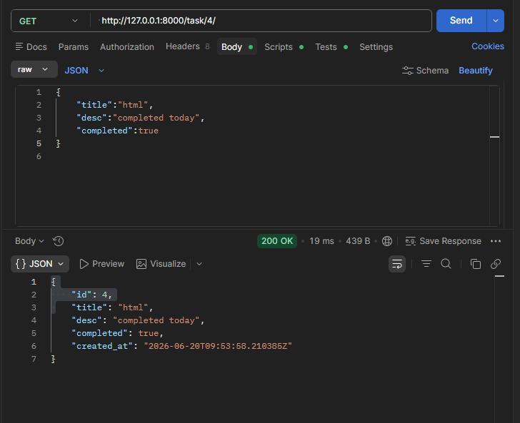
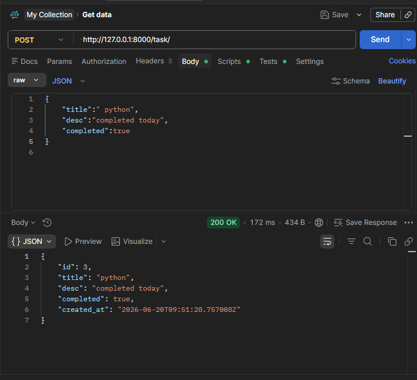
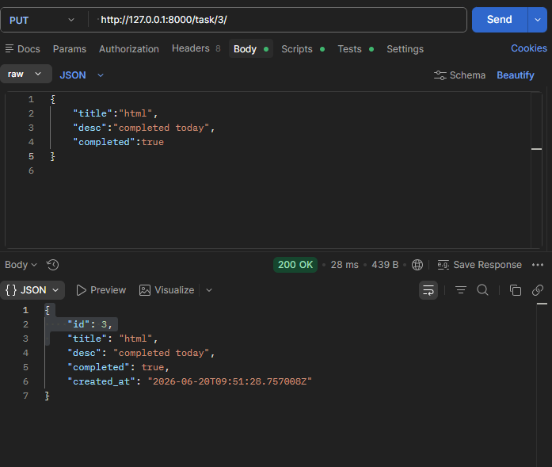
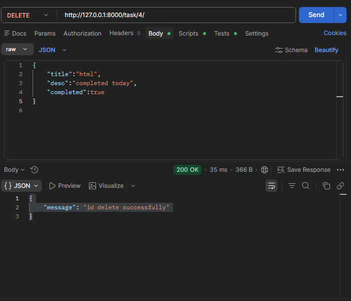

# Task Management REST API

A RESTful API built using Django REST Framework for managing tasks. The API allows users to create, retrieve, update, and delete tasks through HTTP requests.

## Overview

The Task Management REST API is designed to perform CRUD (Create, Read, Update, Delete) operations on tasks. It provides API endpoints that can be tested using tools such as Postman.

This project was developed to gain practical experience with Django REST Framework, API development, serialization, and request handling.

## Features

* Create Tasks
* View All Tasks
* View a Single Task
* Update Existing Tasks
* Delete Tasks
* JSON Response Format
* RESTful API Design

## Technologies Used

* Python
* Django
* Django REST Framework
* SQLite
* Postman

## API Endpoints

### Get All Tasks

```http
GET /api/task/
```

### Create Task

```http
POST /api/task/
```

### Get Single Task

```http
GET /api/detail/<id>/
```

### Update Task

```http
PUT /api/detail/<id>/
```

### Delete Task

```http
DELETE /api/detail/<id>/
```

## Sample JSON

```json
{
    "title": "Complete Django Project",
    "completed": false
}
```

## Key Concepts Implemented

* Django REST Framework
* Serializers
* API Views
* CRUD Operations
* JSON Data Handling
* HTTP Methods (GET, POST, PUT, DELETE)

## Screenshots

### Get Tasks


### Post Task


### Put Task


### Delete Task


## Learning Outcomes

* REST API Development
* Django REST Framework
* API Testing with Postman
* Serialization
* Request and Response Handling
* CRUD Operations

## Author

Aruna P

B.Tech Information Technology Graduate

Aspiring Python Full Stack Developer
